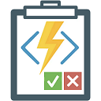

# Azure.Functions.Testing

[Azure.Functions.Testing](https://github.com/LeeSanderson/Azure.Functions.Testing) is an integration testing helper library for Azure Functions in the style of 
[WebApplicationFactory](https://learn.microsoft.com/en-us/aspnet/core/test/integration-tests).

The package leverages the [Azure Function Core Tools](https://learn.microsoft.com/en-us/azure/azure-functions/functions-run-local) to configure an launch an Azure Functions
project and allow a Test project to make HTTP requests to the Function HTTP Trigger endpoints.

When running the Function via Azure Function Core Tools, additional arguments can be specified in the constructor of the `FunctionApplicationFactory`.
The [func start](https://learn.microsoft.com/en-us/azure/azure-functions/functions-core-tools-reference?tabs=v2#func-start) documentation defines a list of valid arguments.

See the [package documentation](https://github.com/LeeSanderson/Azure.Functions.Testing/blob/main/Src/Azure.Functions.Testing/NuGet/PackageReadme.md) and [demos](https://github.com/LeeSanderson/Azure.Functions.Testing/tree/main/Tests/Dotnet) for examples of typical usage. 